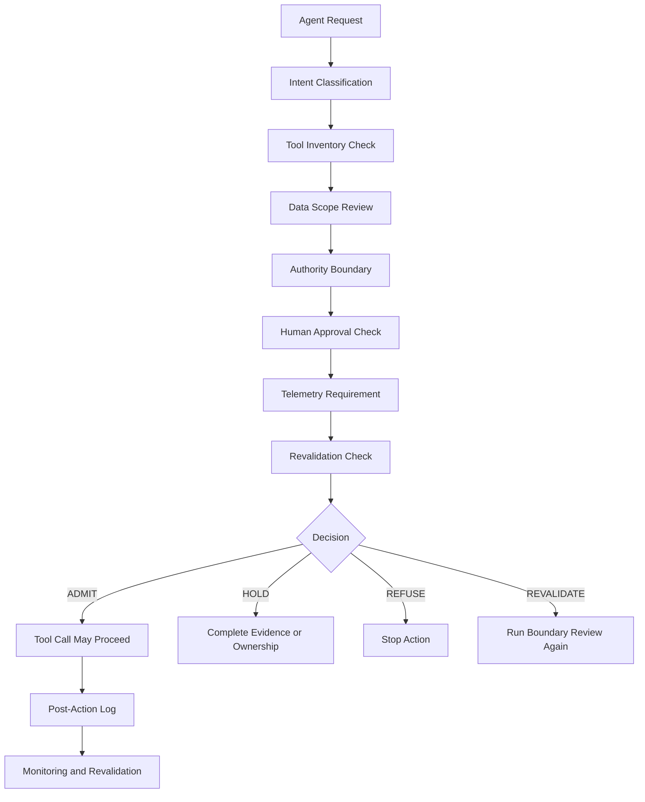

# Architecture Diagram

## Agent Action Boundary Flow



---

## Boundary Principle

```text
Tool access is not action authority.
```

An enterprise agent may be allowed to observe or draft without being allowed to execute, send, update, approve, or trigger protected workflow movement.
